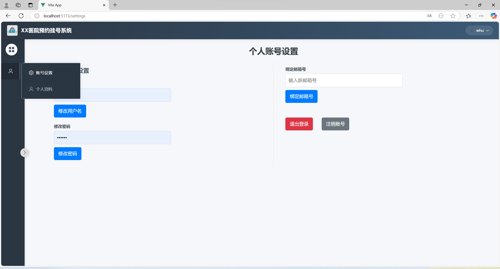
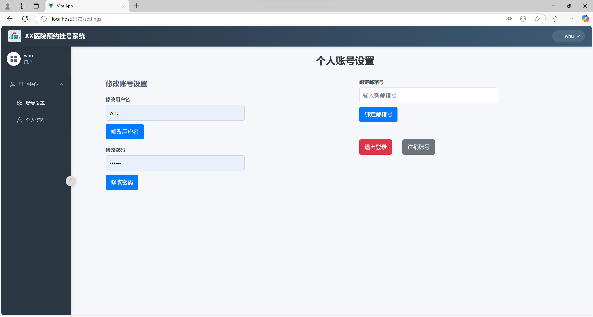

# 挂号系统前端
> test.sql是数据库的建库文件/

❗➡️后端配置了代理端口，运行本系统需要 **打开Clash** ，调整 Mixed Port 端口为 7890（该端口为 Clash 默认端口，如果没有修改过则不需要修改）

### 2月19日更新
- 创建初始页面
- 添加注册功能
- 添加登录功能
- 尝试添加验证码功能
- 添加页面跳转功能和后端API调用接口

### 2月20日更新
- 添加个人信息设置页面，支持用户名称、密码的修改
- 完善验证码的获取逻辑和显示逻辑
- 添加退出登录和注销账号功能
- 添加模态框密码授权确认功能
- 优化前端界面
- 优化路由引导方式

### 2月21日更新
- 添加邮箱绑定功能
- 添加邮箱验证码发送功能
- 添加邮箱验证码验证登录功能
- 更新用户表（users）结构，添加邮箱字段（可选）

### 2月22日更新
- 添加医生信息表（doctorsX） (X=1,2,3,4,5,6,7)
- 添加医生值班表（doctors）
- 修复登陆页面的邮箱验证码错误
- 进行应用主界面的撰写

### 3月5日更新
- 添加验证码请求限制
- 添加通知消息模板
- 美化登录/注册页面

### 3月6日更新
- 修复注册时邮箱号无法保存的问题

### 3月10日更新
- 添加403、404、500页面
- 添加圆形加载动画 
- 添加倒计时按钮组件

### 3月11日更新
- 添加侧边栏和header
- 修复用户设置页面排版的问题

### 3月16日更新
- 完善侧边栏样式，解决侧边栏收缩伸张造成的页面布局问题

### 3月19日更新
- 添加消息通知组件
- 添加个人信息页面
- 修复侧边栏展开的bug

### 3月20日更新
- 添加用户/管理员的权限管理
- 数据库更新（5.sql）

### 4月6日更新
- 完善后端AI接口，使用 Gemini-2.0-flash-lite 作为挂号引导 AI
- 优化AI消息显示，支持表格，引用等多种 Markdown 文本的渲染显示

### 4月10日更新
- 完善侧边栏，目录结构封装进组件内，减少冗余
- 实现医生管理页面

### 4月11日更新
- 修复医生管理页面无法正确修改医生信息的bug

## 效果

